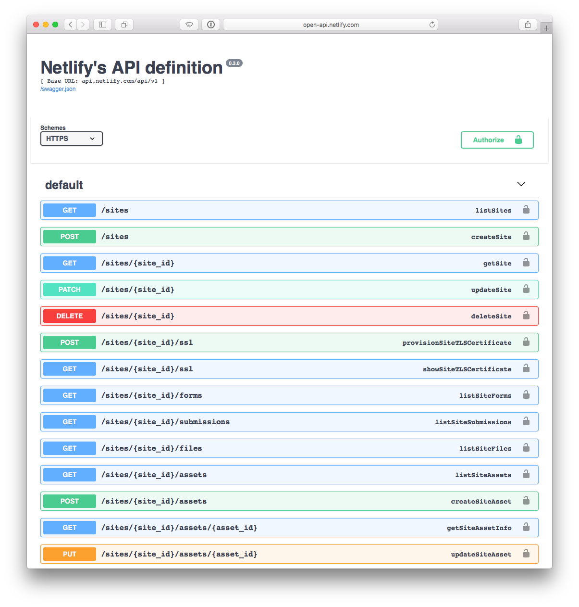

# Netlify open-api

This repository contains Netlify's API definition in the [Open API format](https://github.com/OAI/OpenAPI-Specification/blob/master/versions/2.0.md) (AKA Swagger). 

## Usage

The `swagger.yml` file is the master copy of the Open API 2.0 definition.  Additional context on using the API can be found on our [Docs site](https://www.netlify.com/docs/api/).

The spec is published and versioned for various ecosystems:

### SwaggerUI (Web UI)

You can view the definition using [Swagger UI](https://swagger.io/tools/swagger-ui/) by visiting [open-api.netlify.com](http://open-api.netlify.com) which provides limited interaction with the API from the browser.



### Go Client

[](https://godoc.org/github.com/netlify/open-api/go) [](https://goreportcard.com/report/github.com/netlify/open-api) [](https://github.com/netlify/open-api/releases/latest)

```console
$ go get github.com/netlify/open-api/...
```

### npm module

### JS Clients

## Go Client

We use [go-swagger](https://github.com/go-swagger/go-swagger) to validate our spec against the 2.0 spec of Open API.

We currently depend on version 0.16.0 of the swagger toolchain. You can download the binary for your platform from this release page:

https://github.com/go-swagger/go-swagger/releases/tag/0.16.0

### Spec validation

You can run this command to validate the spec:

	make validate

### Code generation

Currently, we're generating client code for Go, but we're planning on releasing libraries in any language that can generate code from the spec.

You can use this command to generate the Go client:

	make generate
	
You may first want to edit swagger.yml to add your field or endpoint definitions.

## JS Client

Swagger's JS client can dynamically create a client from a spec either from a URL or spec object.

See [swagger-js](https://github.com/swagger-api/swagger-js)


### Usage
```js
<script src='browser/swagger-client.js' type='text/javascript'></script>
<script>
var swaggerClient = new SwaggerClient('https://open-api.netlify.com/swagger.json');
</script>
```

You can also consume the swagger spec as an npm module:

```console
$ npm install @netlify/open-api
# or
$ yarn add @netlify/open-api
```

```js
import spec from '@netlify/open-api' // import the spec object into your project
```

The module also ships a copy of the original `yml` spec file at `@netlify/open-api/swagger.yml`.

## Making a new release

1. bump the version of swagger.yml file
2. regenarate go client (if you haven't)
3. bump a JS package version with `npm version [major|minor|patch]` (updates package.json, create a git tag)
4. make sure everything is committed and `git push && git push --tags` to push to the origin
5. write a release note for the tag in [Releases](https://github.com/netlify/open-api/releases) page
6. publish to npm (`npm install && npm publish`)


## Explore API

Go to https://open-api.netlify.com to explore the spec definitions using Open-Api's UI.

## License

MIT. See [LICENSE](LICENSE) for more details.
